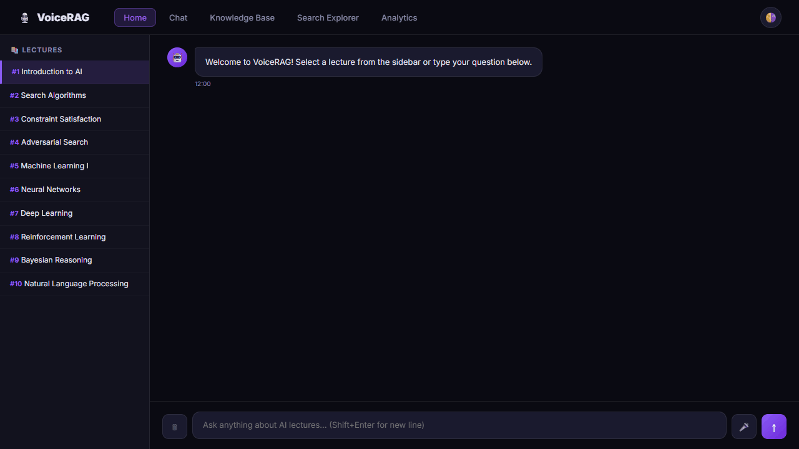

# 🎙️ VoiceRAG — AI Lecture Assistant

A voice-powered **Retrieval-Augmented Generation (RAG)** system built over 30 MIT AI lecture transcripts. Ask questions by voice or text — the system retrieves the most relevant lecture segments and synthesises an answer using the Gemini API.

---

## 🎬 Demo




---

## ✨ Features

| Feature | Details |
|---|---|
| 🎤 Voice Input | Web Speech API (SpeechRecognition) with interim transcription |
| 🔍 Semantic Search | BGE-M3 1024-dim embeddings + cosine similarity via scikit-learn |
| 🤖 LLM Generation | Gemini API (gemini-2.5-flash), streamed token-by-token (SSE) |
| 📚 Knowledge Base | Browse all 30 lectures, preview transcript chunks |
| 📊 Analytics | Live dashboard: similarity scores, most-queried lectures, Recharts |
| 🌗 Dark / Light Mode | One-click theme toggle across all pages |

---

## 🗂️ Project Structure

```
VoiceRAG/
│
├── app.py                      ← Flask API server (5 endpoints)
├── pyrightconfig.json          ← Pyright/Pylance settings
├── requirements.txt            ← Python dependencies
├── .gitignore
│
├── embeddings/                 ← RAG pipeline (Python package)
│   ├── __init__.py
│   ├── embed_chunks.py         ← Chunk + embed transcripts → parquet
│   ├── retrieve.py             ← Search + LLM generation logic
│   ├── chunks.json             ← [gitignored] parsed transcript chunks
│   └── embeddings.parquet      ← [gitignored] embedding vectors (~9 MB)
│
├── transcripts/                ← Transcript data & parsing pipeline
│   ├── JSON_parser.py          ← Parses JSON3 → chunks.json
│   ├── speech_to_text.py       ← (Optional) Whisper-based STT pipeline
│   └── JSON3/                  ← [gitignored] raw YouTube JSON3 captions
│
├── raw_audio/                  ← [gitignored] downloaded lecture .webm files
│
└── frontend/                   ← React app (5 pages)
    ├── package.json
    ├── public/
    └── src/
        ├── App.js              ← Router (react-router-dom v6)
        ├── ThemeContext.js     ← Global dark/light theme context
        ├── index.css           ← CSS custom properties + global reset
        ├── components/
        │   ├── Navbar.js / .css
        │   ├── WaveformBars.js / .css
        │   └── LectureSidebar.js / .css
        └── pages/
            ├── Landing.js / .css       ← Hero with particle canvas
            ├── Chat.js / .css          ← Split-view RAG chat
            ├── KnowledgeBase.js / .css ← Lecture grid + chunk preview
            ├── SearchExplorer.js / .css← Visual similarity search
            └── Analytics.js / .css     ← Dashboard (Recharts)
```

---

## 🚀 Quick Start

### Prerequisites
- **Python 3.8+** (Anaconda recommended)
- **Node.js 18+**
- **Gemini API Key** (Get one from Google AI Studio)
- **[Ollama](https://ollama.com/)** running locally for embeddings:
  ```bash
  ollama pull bge-m3      # embedding model
  ```

### 1 — Install Python dependencies
```bash
pip install -r requirements.txt
```

### 2 — Build the knowledge base (first time only)
```bash
# Parse transcripts → chunks.json
python transcripts/JSON_parser.py

# Embed chunks → embeddings.parquet  (takes a few minutes)
python embeddings/embed_chunks.py
```

### 3 — Configure Environment and Start Backend
```bash
# Copy the environment template and add your Gemini API Key
cp .env.example .env

# Run from the project root so package imports resolve correctly
python app.py
```
Backend starts at `http://localhost:5000`

### 4 — Start the frontend
```bash
cd frontend
npm install
npm start
```
App opens at `http://localhost:3000`

---

## 🔌 API Endpoints

| Method | Endpoint | Description |
|---|---|---|
| `GET` | `/api/health` | Server health check |
| `GET` | `/api/lectures` | All 30 lectures with metadata |
| `GET` | `/api/lectures/<id>/chunks` | Paginated transcript chunks |
| `POST` | `/api/search` | Semantic search (no LLM) |
| `POST` | `/api/query` | Full RAG query (blocking) |
| `POST` | `/api/query/stream` | Full RAG query (SSE streaming) |
| `GET` | `/api/analytics` | Session analytics |

---

## 🧠 How It Works

```
User Question
     │
     ▼
BGE-M3 Embedding  ──→  Cosine Similarity  ──→  Top-K Chunks
                              ↓
                     Prompt + Context
                              ↓
                      Gemini API (gemini-2.5-flash)
                              ↓
                    Streamed Answer + Sources
```

---

## 📦 Data (not committed)

Large files are excluded from git via `.gitignore`:

| Path | Size | Description |
|---|---|---|
| `raw_audio/` | ~1 GB | Downloaded lecture `.webm` files |
| `transcripts/JSON3/` | ~21 MB | YouTube JSON3 caption files |
| `embeddings/chunks.json` | ~1.5 MB | Parsed transcript chunks |
| `embeddings/embeddings.parquet` | ~9 MB | Pre-computed BGE-M3 vectors |

---

## 🛠️ Tech Stack

**Backend:** Python · Flask · Flask-CORS · scikit-learn · pandas · numpy · Google Generative AI

**Frontend:** React · react-router-dom · Recharts · Web Speech API

**Models:** BGE-M3 (embedding, via local Ollama) · Gemini 2.5 Flash (generation, via Gemini API)


---

## 📄 License

This project is licensed under the **MIT License**. See the [LICENSE](https://github.com/YASHSINGHJI/VoiceRAG/blob/main/LICENSE.md) file for full details.

You are free to use, modify, and distribute this software for both personal and commercial purposes. Please include the original license and copyright notice in any distributed copies.

### Attribution

- **MIT AI Lectures:** Lecture transcripts sourced from MIT OpenCourseWare (OCW)
